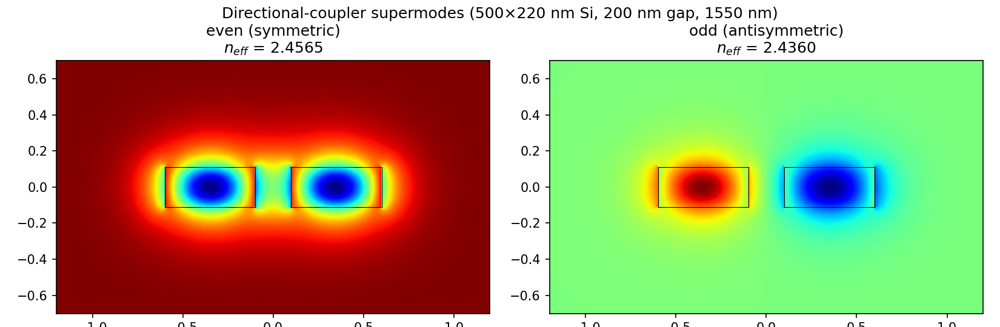
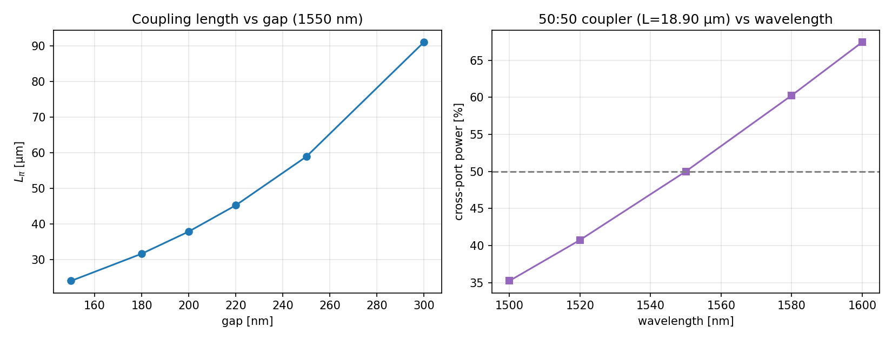
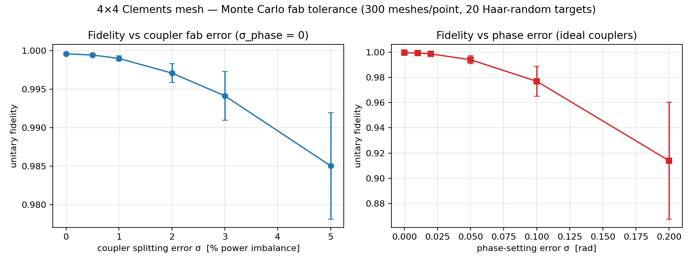
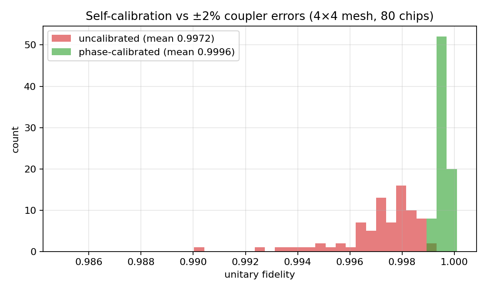
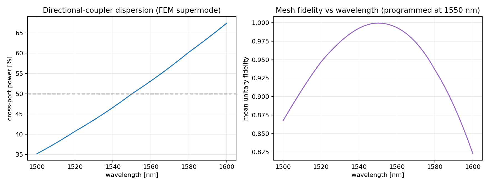

# Programmable Unitary Photonic Processor — Clements Mesh Design & Fab-Tolerance Study


A simulation and design study of the **4×4 programmable photonic processor** —
the Mach–Zehnder-interferometer (MZI) mesh architecture used in photonic AI
matrix-multiply accelerators and in linear-optical quantum computing. It
implements an exact, test-verified **Clements decomposition** and uses it to
quantify how fabrication imperfections degrade the processor and how on-chip
phase calibration recovers it.

> **Scope (read this first).** This is a **modeling / simulation** project —
> not a fabricated or measured device. The directional coupler is
> characterized from first principles by **finite-element eigenmode
> (supermode) analysis** (femwell / scikit-fem): the even/odd supermode
> effective indices are solved from Maxwell's equations and set the coupling
> length `L_π = λ / (2·Δn)`, which drives the whole mesh model. A **Meep FDTD
> script** is included as an independent time-domain cross-check. The
> phase-shifter loss values and the assumed per-element fabrication spreads
> are representative engineering numbers, not a specific foundry's PDK data —
> the marked hand-off for a full PDK-calibrated run is in *Next steps*.

## What it does

1. **FEM-characterized directional coupler** (`fdtd/coupler_modes.py`) —
   solves the even/odd supermodes of the coupled 500×220 nm Si waveguide pair
   with a finite-element Maxwell solver, extracts `n_even`, `n_odd`, and the
   coupling length, and sweeps gap and wavelength. Single-waveguide n_eff =
   2.445 (textbook TE₀); at a 200 nm gap, `L_π = 37.8 µm` / `L_3dB = 18.9 µm`.
   A Meep FDTD script (`fdtd/coupler_fdtd_meep.py`) reproduces this in the time
   domain as an independent check.
2. **Physics-based components** (`photonic_mesh/components.py`) — the coupler
   transfer matrix (fed by the FEM data via `coupler_fem.py`), thermo-optic
   phase shifter, and the full MZI with **per-element insertion loss and
   independently imperfect couplers**.
3. **Exact Clements decomposition** (`photonic_mesh/clements.py`) — maps any
   N×N unitary to the physical (θ, φ) setting of every MZI plus an output
   phase layer. Verified to reconstruct Haar-random unitaries for N = 2…8 and
   the DFT/permutation matrices to fidelity 1 − O(10⁻¹⁰).
4. **Monte-Carlo fab-tolerance study** (`run_study.py`) — fidelity vs coupler
   splitting error and vs phase error, a loss budget, and FEM-driven
   wavelength dependence.
5. **Self-calibration** — given measured (fixed) coupler errors, re-optimizes
   all internal/external/output phases per chip and recovers fidelity.

### FEM-solved coupler supermodes

The even (symmetric) and odd (antisymmetric) supermodes whose index splitting
sets the coupling length — solved from Maxwell's equations, not assumed:




## Key results

4×4 mesh (6 MZIs), 0.10 dB/coupler, 0.05 dB/phase-shifter, 20 Haar-random
targets, 300 meshes per error point:

| Case | Mean unitary fidelity |
|---|---|
| Ideal couplers, exact phases | 0.99958 *(differential-loss floor — see below)* |
| ±2 % coupler splitting error | 0.9971 |
| ±0.05 rad phase error | 0.9940 |
| Combined ±2 % / ±0.05 rad | 0.9917 |
| ±2 % coupler error **after phase calibration** | **0.99958 (worst chip 0.9992)** |

Mesh transmission at the assumed per-element losses: **−0.90 dB**.

Three findings worth stating explicitly, because they are the point of the
study rather than the plots:

- **The zero-error fidelity floor of 0.99958 is physics, not numerics.** In a
  rectangular mesh, edge modes traverse fewer MZIs than center modes, so
  uniform per-MZI loss becomes *path-dependent* (differential) loss, which
  distorts the implemented matrix even with perfect phases. Real designs add
  loss-balancing sections; the model quantifies exactly how much this costs.
- **Phase calibration recovers essentially all coupler-error infidelity**
  (~7× reduction in mean infidelity, back to the differential-loss floor).
  This is *why* programmable meshes are manufacturable: the phase shifters
  that program the unitary double as trim knobs for fabrication error.
- **Phase error hurts more than coupler error at equal magnitude, and it is
  harder to remove** — coupler error is fixed per chip (calibratable) while
  phase error is dynamic (thermal crosstalk, DAC resolution), so it sets the
  real accuracy floor.





## Reproduce

```bash
pip install -r requirements.txt
python run_study.py            # mesh study -> results/ (figures + summary.txt)
pytest -q                      # or: python tests/test_clements.py (no pytest needed)

# FEM coupler characterization (regenerates the coupler data + figures):
pip install -r requirements-fdtd.txt
python fdtd/coupler_modes.py

# Optional FDTD cross-check (needs Meep via conda):
python fdtd/coupler_fdtd_meep.py
```

`run_study.py` uses the FEM-solved coupler data if present
(`results/coupler_fem_backed.json`) and transparently falls back to the
analytic coupled-mode model otherwise (it prints which one it used).

## Layout

```
photonic_mesh/
  components.py     coupler / phase-shifter / MZI physics
  coupler_fem.py    loads the FEM supermode data -> coupler cross-coupling
  clements.py       decomposition + forward mesh model + fidelity metrics
fdtd/
  coupler_modes.py       femwell FEM supermode solve + gap/wavelength sweeps
  coupler_fdtd_meep.py   Meep FDTD time-domain cross-check (run locally)
layout/
  mesh_layout.py         gdsfactory passive 4x4 mesh -> GDS + PNG
  drc_check.py           KLayout width/spacing DRC
tests/
  test_clements.py  nulling & commutation identities + decomposition exactness
  test_coupler_fem.py    guards on the FEM coupler results
run_study.py        Monte Carlo, calibration, wavelength sweep -> results/
results/            generated figures, summary.txt, coupler_fem_backed.json
```

## Conventions

- Coupler: `C(θc) = [[cos θc, i sin θc], [i sin θc, cos θc]]`; θc = π/4 is
  50:50. Near 50:50, a ±x % cross-power imbalance ≈ ±x/100 rad angle error.
- MZI (Clements convention): `U = C₂·P(θ)·C₁·P(φ)`, θ internal (splitting),
  φ external (output) phase.
- Fidelity: `F = |Tr(Uₜ†Uₐ)|² / (N·Tr(Uₐ†Uₐ))` — invariant to global
  loss/phase, penalizes distortion of the unitary (including differential
  loss).

## Next steps

The coupler is FEM-characterized and a passive GDS layout exists. Remaining:

1. **GDS layout** — passive 6-MZI mesh with FEM-designed couplers and grating
   I/O is built in `layout/mesh_layout.py` (see `layout/README.md`). Topology
   and width-DRC are clean; spacing-DRC in the fan-in routing is still being
   cleaned up (bundle routing / compact-pitch redesign). *(In progress.)*
2. **Heaters/metal** — add thermo-optic phase shifters + routing as the next
   layout layer.
3. **PDK calibration** — re-run the Monte Carlo with a foundry's published
   process-corner data as the error distributions.
4. **3D FDTD** — the included Meep script is a 2D effective-index check; a full
   3D run pins the coupling length to sub-percent for tape-out.

## References

- W. R. Clements et al., "Optimal design for universal multiport
  interferometers," *Optica* **3**, 1460 (2016).
- M. Reck et al., "Experimental realization of any discrete unitary
  operator," *Phys. Rev. Lett.* **73**, 58 (1994).
