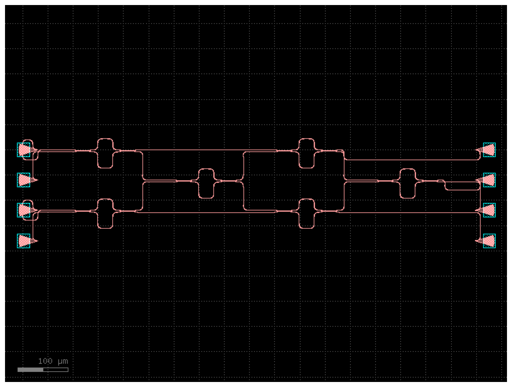

# Passive GDS layout — 4×4 Clements mesh

Passive photonic layout of the 6-MZI rectangular Clements mesh, built in
gdsfactory from the **FEM-designed directional coupler** (200 nm gap,
18.9 µm 50:50 length). Waveguides, couplers, bends, and grating-coupler I/O
only — no heaters/metal yet (that is the next layer).



## Files

```
mesh_layout.py   parametric layout -> results/clements_mesh_4x4.gds + .png
drc_check.py     KLayout DRC (width + spacing) -> results/drc_errors.gds
```

Run:
```bash
pip install -r ../requirements-fdtd.txt   # (gdsfactory + klayout come via this or requirements)
python layout/mesh_layout.py
python layout/drc_check.py
```

## What is correct

- **Topology:** 6 MZIs in the Clements 2-1-2-1 column pattern (columns
  0,2 act on mode pairs (0,1)&(2,3); columns 1,3 act on (1,2)), matching the
  decomposition in `photonic_mesh/clements.py`. Verified by inspection and by
  the `mzi2x2_2x2` port connectivity.
- **Coupler:** every splitter/combiner is the FEM-designed 200 nm-gap,
  18.9 µm coupler — the layout and the physics model use the same device.
- **I/O:** all 4 inputs and 4 outputs terminate in TE grating couplers.
- **GDS validity:** well-formed hierarchy (19 cells, single top cell), strip
  waveguide on layer 1/0 and slab on 2/0. Opens cleanly in KLayout.
- **DRC width:** 0 violations (no slivers / sub-width waveguides).

## Known-incomplete: spacing DRC

`drc_check.py` reports spacing violations (≈118 below 150 nm) concentrated in
the **inter-column fan-in/fan-out routing**, where the auto-router
(`route_single`) bridges the 60 µm I/O mode pitch into the 4 µm MZI port pitch
and produces parallel segments that run closer than the spacing rule. The
**mesh MZIs and couplers themselves are clean**; the violations are in the
connecting routes.

This is an honest in-progress state. The correct fixes, in order of
preference:

1. **Compact-pitch architecture** — place MZIs on a ~4 µm internal pitch
   (matching their ports) and fan out to the wide grating-coupler pitch only
   at the two ends, so the router never bridges a large pitch mid-mesh.
2. **Bundle routing** — replace per-mode `route_single` with
   `gf.routing.route_bundle(..., separation=…)`, which spaces parallel routes
   to satisfy the rule by construction.
3. **Wider pitch + Euler S-bends** with explicit waypoint control.

Until one of those is applied, treat this layout as a **valid, correct-topology
passive floorplan**, not a tape-out-ready GDS. `drc_check.py` is the tool to
confirm when it becomes clean.
